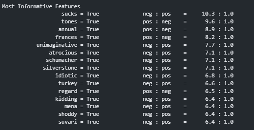

# Text Classification using Naive Bayes

This repository contains a project focused on building a text classification model of Hotel reviews using Natural Language Processing (NLP) techniques. The model is trained to classify movie reviews as either positive or negative, utilizing the Naive Bayes classifier provided by the `nltk` library.

## Table of Contents
1. [Project Overview](#project-overview)
2. [Dataset](#dataset)
3. [Features](#features)
4. [Modeling](#modeling)
5. [Installation](#installation)
6. [Usage](#usage)
7. [Results](#results)
8. [Contributing](#contributing)
9. [License](#license)

## Project Overview
Text classification is a common task in NLP that involves categorizing text into predefined categories. In this project, we classify movie reviews as positive or negative using a Naive Bayes classifier. We preprocess the data by tokenizing the text and extracting useful features to feed into the classifier.

The goal of the project is to:
- Build a text classifier using Naive Bayes.
- Preprocess text data by tokenizing and extracting features.
- Evaluate the model's accuracy and interpret the most informative features.

## Dataset
The dataset used in this project consists of movie reviews labeled as either positive or negative. Each review is processed to extract features that help the classifier learn patterns associated with positive or negative sentiments.

### Data Preprocessing
The text is tokenized, and features such as word occurrences are extracted. Each word in the review is treated as a feature, and the frequency of words in both positive and negative reviews is used to build the classifier.

## Features
The project extracts features from the movie reviews such as:
- Individual words or tokens from the reviews.
- Boolean features indicating the presence or absence of specific words.

Example of extracted features:
```python
{'the': True, 'movie': True, 'was': True, 'great': True, 'and': True, 'engaging': False}
```

The most informative features are words that strongly indicate a positive or negative sentiment, such as "sucks" (negative) or "great" (positive).

## Modeling
A Naive Bayes classifier is used to perform the classification task. The steps involved in the modeling process are:
1. **Data Preprocessing**: Tokenizing the text and converting it into features.
2. **Model Training**: Using the Naive Bayes classifier to train the model on the training set.
3. **Evaluation**: Calculating the model's accuracy and displaying the most informative features.


## Installation
To run this project locally, follow these steps:

1. Clone the repository:
    ```bash
    git clone https://github.com/leharp/text-classification.git
    ```
3. Run the Jupyter notebook:
    ```bash
    jupyter notebook Text_classification.ipynb
    ```

## Usage
You can run the Jupyter notebook to train the classifier and evaluate its performance on a test dataset.

Here’s how you can predict the sentiment of a new movie review:
```python
new_review = "This movie was fantastic with great performances."
new_features = extract_features(new_review.split())
print(classifier.classify(new_features))
```

## Results
The classifier achieves an accuracy of **86%** on the test set, which is quite good for a basic Naive Bayes classifier. The most informative features include words that strongly indicate positive or negative sentiment, such as:
- Negative indicators: `sucks`, `atrocious`, `idiotic`
- Positive indicators: `great`, `tones`, `frances`


## Contributing
Contributions are welcome! If you'd like to improve the model, add more features, or enhance the preprocessing steps, feel free to fork the repository and submit a pull request.

## License
This project is licensed under the MIT License. See the `LICENSE` file for details.
